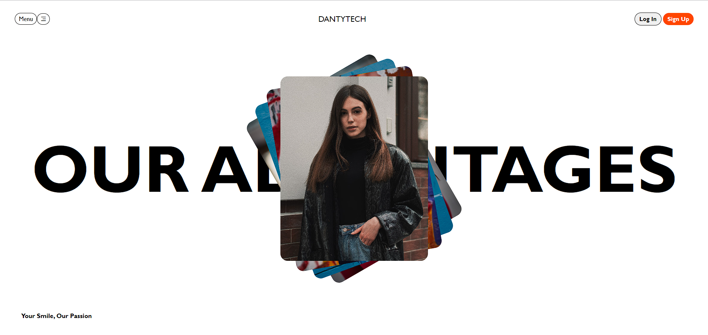

## DantyTech Clone

 

---

### 💻 HTML Practice Series

This is my first project of HTML series. In this i used HTML, CSS to create a similar looking (Cloned) website.

Here is the preview of website :

